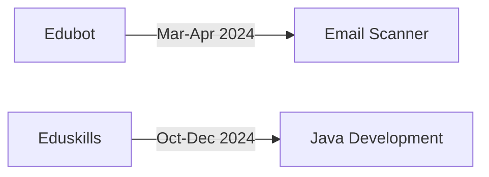
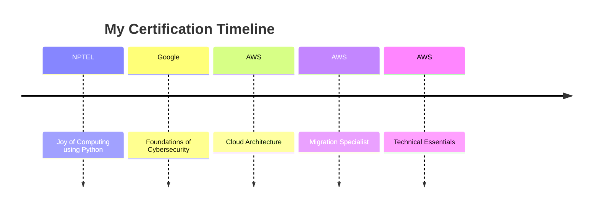

```markdown
<div align="center">
  
# 🚀 Hello World, I'm Mohan Balu V! 
  
[](https://git.io/typing-svg)

</div>

<div align="center">
  
</div>

## 🎯 Quick Facts
```python
class AboutMe:
    def __init__(self):
        self.name = "Mohan Balu V"
        self.education = "SRM University AP"
        self.gpa = "7.8/10.0"
        self.interests = ["AI/ML", "Full Stack", "Cloud Computing"]
        self.current_focus = "Building scalable AI solutions"
```

## 🔮 Current Adventures

<table>
  <tr>
    <td width="50%">
      <h3>🚀 Advanced Email Scanner</h3>
      <p>Crafting a sophisticated Java-based system that's making emails 99% safer!</p>
    </td>
    <td width="50%">
      <h3>🌍 Disaster Preparedness Platform</h3>
      <p>Building hope, one line of code at a time.</p>
    </td>
  </tr>
</table>

## 💼 Professional Journey

<div align="center">



</div>

## 🛠️ Tech Arsenal

<div align="center">

### 👨‍💻 Languages
[](https://skillicons.dev)

### 🔧 Frameworks & Tools
[](https://skillicons.dev)

### 💾 Databases
[](https://skillicons.dev)

</div>

## 🌟 Flagship Projects

<div align="center">

<table>
  <tr>
    <td>
      <h3>🏦 Banking Management System</h3>
      
      
    </td>
    <td>
      <h3>🛍️ E-ShopHub</h3>
      
      
    </td>
  </tr>
</table>

</div>

## 🎓 Learning Journey

<div align="center">



</div>

## 📫 Let's Connect!

<div align="center">
  
[](mailto:mohanbalu292@gmail.com)
[](https://www.linkedin.com/in/mohanbalu/)
[](https://mohanbalu-resume.netlify.app/)

</div>

## 📊 GitHub Analytics

<div align="center">
  
[](https://git.io/streak-stats)


</div>

---

<div align="center">
  
  
  ### "Code is poetry written in logic" 💭
</div>
```
