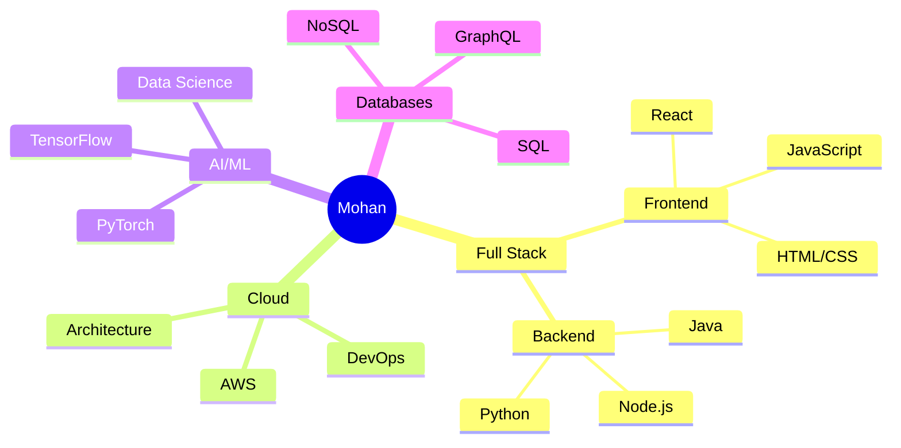
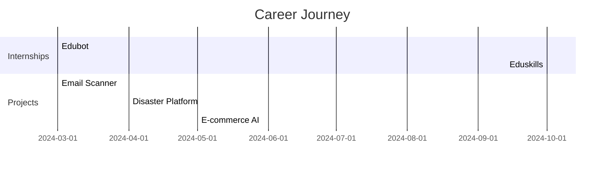
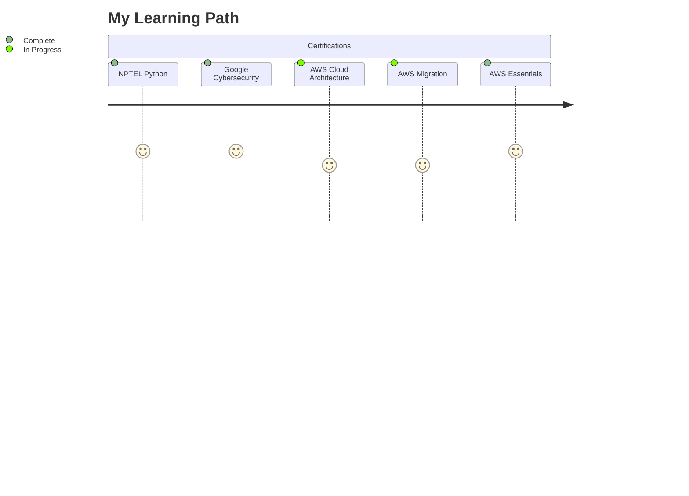

<div align="center">
  
# 🌟 Mohan Balu V | Digital Craftsman

[](https://git.io/typing-svg)

<picture>
  <source media="(prefers-color-scheme: dark)" srcset="https://github.com/Mohanbalu/Mohanbalu/blob/output/github-contribution-grid-snake-dark.svg" />
  <source media="(prefers-color-scheme: light)" srcset="https://github.com/Mohanbalu/Mohanbalu/blob/output/github-contribution-grid-snake.svg" />
  
</picture>

</div>

<div align="center">
  
</div>

<h2 align="center">⚡ Tech Ecosystem</h2>

<div align="center">
  


</div>

## 🎯 Professional Snapshot

```typescript
interface Developer {
  name: string;
  role: string;
  education: Education;
  code: string[];
  tools: string[];
  challenge: string;
}

const mohan: Developer = {
  name: "Mohan Balu V",
  role: "Full Stack Developer",
  education: {
    university: "SRM University AP",
    degree: "Bachelor's in Computer Science",
    gpa: 7.8
  },
  code: ["Python", "Java", "JavaScript", "C++", "C#"],
  tools: ["React", "AWS", "Docker", "TensorFlow"],
  challenge: "Building scalable AI solutions that impact millions"
};
```

## 🚀 Innovation Hub

<table>
<tr>
<td width="50%" align="center">
  
  ### 🔐 Advanced Email Scanner
  
  
  
  
  ```python
  def impact():
    return {
      "security": "99% improvement",
      "processing": "500k+ emails/day",
      "accuracy": "99.9%"
    }
  ```
  
</td>
<td width="50%" align="center">

  ### 🌍 Disaster Preparedness Platform
  
  
  
  
  ```python
  def metrics():
    return {
      "response_time": "-30%",
      "accuracy": "95%",
      "coverage": "50+ regions"
    }
  ```
  
</td>
</tr>
</table>

## 💼 Professional Timeline

<div align="center">



</div>

## 🛠️ Technology Arsenal

<div align="center">

<h3>🔥 Primary Stack</h3>

[](https://skillicons.dev)

<h3>☁️ Cloud & DevOps</h3>

[](https://skillicons.dev)

<h3>🗄️ Data Layer</h3>

[](https://skillicons.dev)

</div>

## 📊 Performance Metrics

<div align="center">
  
<table>
<tr>
<td width="50%">

[](https://git.io/streak-stats)

</td>
<td width="50%">

[](https://github.com/anuraghazra/github-readme-stats)

</td>
</tr>
</table>


</div>

## 🎓 Learning & Growth

<div align="center">



</div>

## 🤝 Let's Connect

<div align="center">
  
[](https://mohanbalu-resume.netlify.app/)
[](https://www.linkedin.com/in/mohanbalu/)
[](mailto:mohanbalu292@gmail.com)

</div>

---

<div align="center">
  


### "Transforming Ideas into Digital Reality" 💫


</div>
